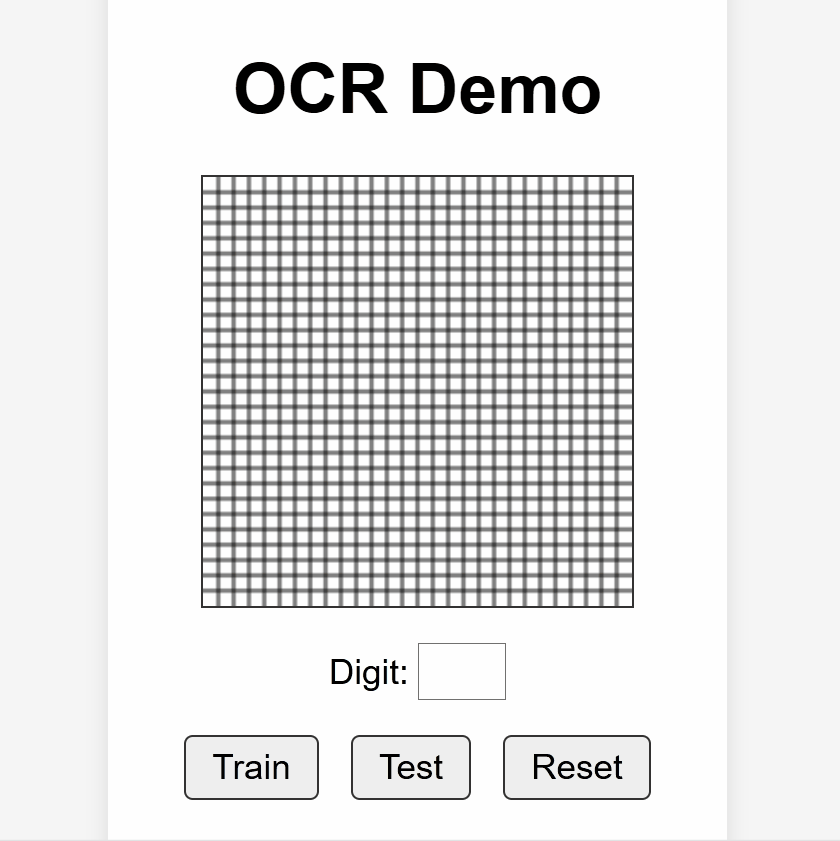
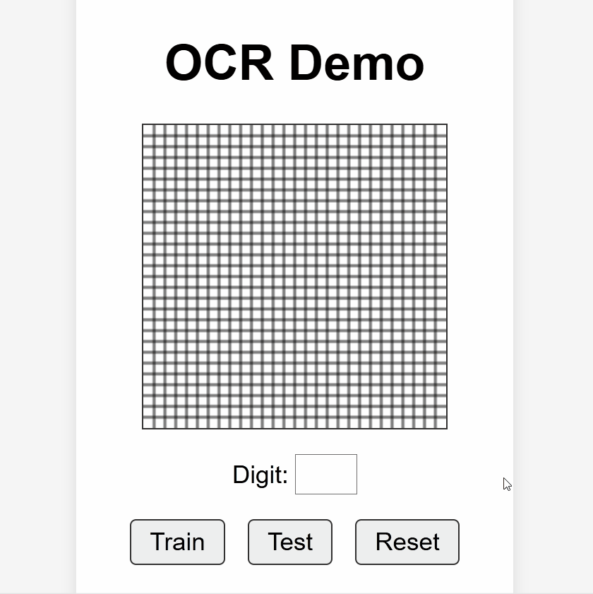

# 🧠 OCR_AI – Lightweight Neural Network for Handwritten Digit Recognition (No ML Libraries)

**OCR_AI** is a self-implemented neural network written in Python and powered only by NumPy. It recognizes handwritten digits from the [MNIST dataset](http://yann.lecun.com/exdb/mnist/) using a 28x28 input grid. This project is **completely independent of machine learning libraries** like TensorFlow or PyTorch and is intended for learning, experimentation, or lightweight deployment.

>💡 Inspired in part by *"500 Lines or Less – Optical Character Recognition"* by Marina Samuel.   ([Read it here](https://aosabook.org/en/500L/optical-character-recognition-ocr.html))

---

## 📸 Example Use Case

The model processes 28x28 grayscale images (flattened into 784-dimensional vectors), runs them through a feedforward neural network, and outputs a digit prediction from 0 to 9.


## 🎬 Demo

###  Live Testing (Drawing in the Browser)

> The user draws a digit on the 28x28 canvas and gets a prediction in real time using the trained model.




###  Training on MNIST Dataset

> The model updates its weights and biases in real time based on new user-supplied training samples.




## 📁 Project Structure

OCR_AI/  
│  
├── src/  
│ ├── ocr.py # Neural network logic  
│ ├── server.py # Web basic server to interact with the model  
│ ├── ocr.js # Input preprocessing   
│ ├── ocr.html # Page Structure  
│ ├── wb_training.py # Script to train the model using mnist
│ └── neural_network.json # Stored model weights   
│  
└── README.md  
└── .gitignore  


---

## 🔧 Features

- Fully custom neural network:
  - **Input layer**: 784 neurons (28x28 pixels)
  - **Hidden layer**: customizable (default: 25 neurons)
  - **Output layer**: 10 neurons (digits 0–9)
- Option to **train the model** on MNIST data or **test existing model weights**
- Simple training using `train_on_instance()` for per-sample learning (batch: 1)
- Model weights saved as JSON (`neural_network.json`)
- Activation functions: **ReLU** (default), support for sigmoid
- **No machine learning libraries used** – just **NumPy**


---

## 🚀 Run the Server

```bash
python src/server.py
```

## 🙏 Credits

- MNIST dataset: http://yann.lecun.com/exdb/mnist/

- Base inspiration: *[500 Lines or Less – Optical Character Recognition"* by Marina Samuel](https://aosabook.org/en/500L/optical-character-recognition-ocr.html)*.

## 📝 License

This project is licensed under the [MIT License](LICENSE).